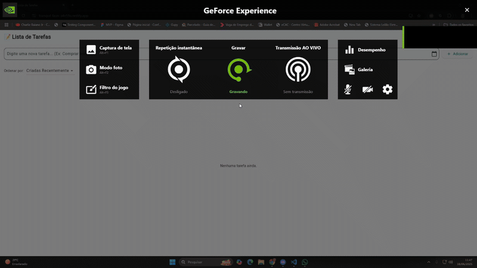
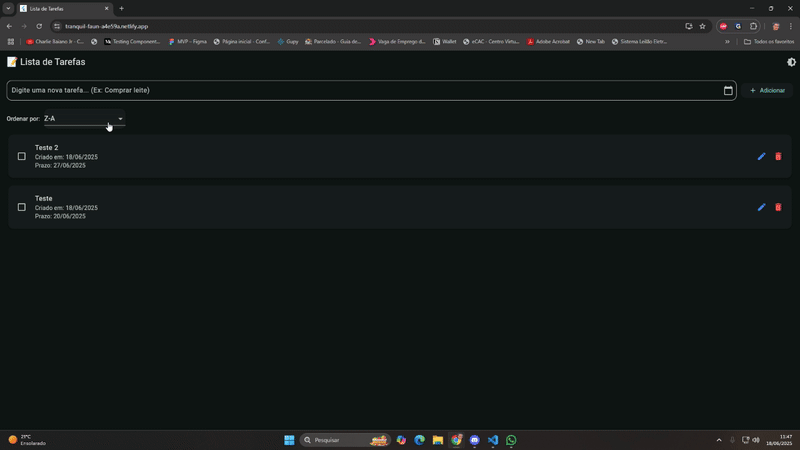

# ToDo List 

Este aplicativo de lista de tarefas, desenvolvido em Flutter, permite aos usuários organizar suas atividades diárias de forma intuitiva e eficiente. Com ele, você pode adicionar, editar, marcar como concluídas e excluir tarefas, ajudando a manter seu dia a dia mais produtivo e organizado.

## 🎥 Demonstração do App




## Funcionalidades

*   **Adicionar Tarefas:** Insira novas tarefas com facilidade, incluindo a opção de definir uma data de prazo.
*   **Visualizar Tarefas:** Veja suas tarefas organizadas com informações como data de criação e prazo.
*   **Editar Tarefas:** Modifique os detalhes de tarefas existentes.
*   **Excluir Tarefas:** Remova tarefas que não são mais necessárias.
*   **Marcar como Concluída:** Marque tarefas como concluídas para acompanhar seu progresso.
*   **Ordenar Tarefas:** Organize sua lista de tarefas por diferentes critérios, como "Criadas Recentemente", "A-Z", "Pendentes primeiro" e "Feitas primeiro".

## Tecnologias Utilizadas

*   [Flutter](https://flutter.dev/) - Framework de desenvolvimento de UI.
*   [Dart](https://dart.dev/) - Linguagem de programação.
*   [Firebase Auth](https://firebase.google.com/docs/auth) - Para autenticação de usuários.
*   [Cloud Firestore](https://firebase.google.com/docs/firestore) - Banco de dados NoSQL em nuvem.
*   [Provider](https://pub.dev/packages/provider) - Gerenciamento de estado.

## Pré-requisitos

Certifique-se de ter as seguintes ferramentas instaladas em sua máquina:

*   [Flutter SDK](https://flutter.dev/docs/get-started/install)
*   [Git](https://git-scm.com/downloads)
*   Um editor de código, como [VS Code](https://code.visualstudio.com/) com a extensão Flutter.

## Instalação

Siga os passos abaixo para configurar e rodar o projeto em sua máquina local:

1.  **Clone o repositório:**
    ```bash
    git clone https://github.com/cadu1324/to_do_list.git
    ```
2.  **Navegue até o diretório do projeto:**
    ```bash
    cd to_do_list
    ```
3.  **Instale as dependências:**
    ```bash
    flutter pub get
    ```
4.  **Execute a aplicação:**
    ```bash
    flutter run
    ```
    Para rodar no Chrome (versão web):
    ```bash
    flutter run -d chrome
    ```

## Uso

Rode o projeto, nele você pode adicionar novas tarefas, marcá-las como concluídas e filtrá-las por categoria.

## Deploy Web

A versão web desta aplicação está disponível em:

[Link para a sua aplicação web deployada](https://tranquil-faun-a4e59a.netlify.app)

## Contribuição

Se você deseja contribuir com este projeto, por favor, siga os seguintes passos:

1.  Faça um fork do repositório.
2.  Crie um novo branch (`git checkout -b feature/sua-feature`).
3.  Faça suas alterações e commit (`git commit -m 'Adiciona nova feature'`).
4.  Envie para o branch original (`git push origin feature/sua-feature`).
5.  Abra um Pull Request.


## Autor

Carlos Eduardo Oliveira

[GitHub](https://github.com/cadu1324)